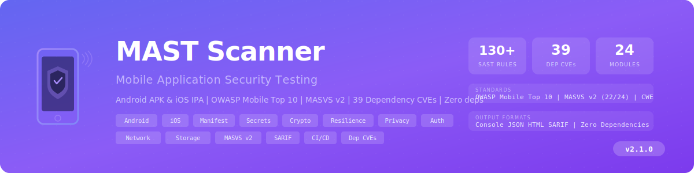

<p align="center">
  
</p>

# Mobile Application Security Testing (MAST) Scanner

An open-source, single-file Python-based **Mobile Application Security Testing** scanner that performs static analysis of **Android APK** and **iOS IPA** files. Detects security misconfigurations, hardcoded secrets, insecure cryptography, network security issues, and maps findings to **OWASP Mobile Top 10 2024**.

**Zero external dependencies** -- runs on Python 3.8+ using only the standard library.

---

## Features

- **73 security checks** across 14 modules for Android and iOS
- **Android APK analysis** -- binary XML manifest parsing, DEX string extraction, native lib scanning
- **iOS IPA analysis** -- Info.plist parsing, Mach-O binary analysis, entitlements extraction
- **Hardcoded secret detection** -- AWS, Google, Stripe, Twilio, SendGrid, Firebase, OAuth, private keys
- **OWASP Mobile Top 10 2024** -- full coverage of all 10 categories
- **4 output formats** -- coloured console, JSON, HTML (dark theme), SARIF (CI/CD)
- **Zero dependencies** -- Python 3.8+ stdlib only (zipfile, plistlib, struct, re, xml.etree)
- **Auto platform detection** -- identifies Android vs iOS from file extension or ZIP contents
- **Exit codes** -- returns `1` if CRITICAL or HIGH findings (CI/CD pipeline gating)

---

## Quick Start

```bash
# Scan an Android APK
python mast_scanner.py app-debug.apk --html report.html --json report.json

# Scan an iOS IPA
python mast_scanner.py MyApp.ipa --severity HIGH --sarif results.sarif

# Verbose scan
python mast_scanner.py app-release.apk -v
```

---

## Security Checks (73 Rules)

### Android Manifest (12 Rules)

| Rule ID | Name | Severity |
|---------|------|----------|
| MAST-MANIFEST-001 | Application is debuggable | CRITICAL |
| MAST-MANIFEST-002 | Application allows backup | HIGH |
| MAST-MANIFEST-003 | Exported activity without permission | HIGH |
| MAST-MANIFEST-004 | Exported service without permission | HIGH |
| MAST-MANIFEST-005 | Exported broadcast receiver | MEDIUM |
| MAST-MANIFEST-006 | Exported content provider | HIGH |
| MAST-MANIFEST-007 | Cleartext traffic allowed | HIGH |
| MAST-MANIFEST-008 | Low minimum SDK version | MEDIUM |
| MAST-MANIFEST-009 | Dangerous permissions | MEDIUM |
| MAST-MANIFEST-010 | SYSTEM_ALERT_WINDOW permission | MEDIUM |
| MAST-MANIFEST-011 | Missing network security config | MEDIUM |
| MAST-MANIFEST-012 | Custom task affinity | LOW |

### Android Secrets (8 Rules)

| Rule ID | Name | Severity |
|---------|------|----------|
| MAST-SECRET-001 | AWS Access Key ID | CRITICAL |
| MAST-SECRET-002 | AWS Secret Key | CRITICAL |
| MAST-SECRET-003 | Google API Key | HIGH |
| MAST-SECRET-004 | Firebase Database URL | MEDIUM |
| MAST-SECRET-005 | Generic API Key/Token | MEDIUM |
| MAST-SECRET-006 | Hardcoded Password | HIGH |
| MAST-SECRET-007 | Private Key | CRITICAL |
| MAST-SECRET-008 | OAuth Client Secret | HIGH |

### Android Crypto (5), Network (5), Storage (5), WebView (5), Components (3)

28 additional rules covering: weak algorithms (MD5/SHA1/DES/ECB), insecure random, TrustManager bypass, hostname verifier bypass, cleartext HTTP, cert pinning absence, world-accessible files, external storage, SQLite without encryption, WebView JavaScript/file access, PendingIntent mutability, and more.

### iOS Plist (8 Rules)

| Rule ID | Name | Severity |
|---------|------|----------|
| MAST-IOS-PLIST-001 | ATS disabled (NSAllowsArbitraryLoads) | HIGH |
| MAST-IOS-PLIST-002 | ATS exception domains | MEDIUM |
| MAST-IOS-PLIST-003 | Custom URL schemes | INFO |
| MAST-IOS-PLIST-005 | Additional ATS exceptions | MEDIUM |
| MAST-IOS-PLIST-006 | Low minimum iOS version | MEDIUM |
| MAST-IOS-PLIST-008 | Multiple Keychain access groups | INFO |

### iOS Secrets (4), Binary (4), Transport (3)

11 additional rules: hardcoded keys in binary, Firebase URLs, OAuth tokens, PIE flag, ARC detection, stack canaries, debug symbols, HTTP URLs, cert pinning absence, custom SSL handling.

### Common Checks (13 Rules)

| Category | Rules | Checks |
|----------|------:|--------|
| Secrets | 6 | AWS, Google Cloud, Stripe, Twilio, SendGrid, Bearer tokens |
| URLs | 4 | HTTP endpoints, staging URLs, localhost, hardcoded IPs |
| Crypto | 3 | Hardcoded keys, MD5 usage, insecure random |

---

## OWASP Mobile Top 10 2024 Coverage

| Category | Coverage |
|----------|---------|
| M1: Improper Credential Usage | Secrets checks, hardcoded passwords |
| M2: Inadequate Supply Chain Security | Min SDK version, library detection |
| M3: Insecure Authentication/Authorization | Exported components, permissions |
| M4: Insufficient Input/Output Validation | WebView JavaScript, URL schemes |
| M5: Insecure Communication | ATS, cleartext, cert pinning, TrustManager |
| M6: Inadequate Privacy Controls | Dangerous permissions |
| M7: Insufficient Binary Protections | PIE, ARC, stack canaries, debug |
| M8: Security Misconfiguration | Manifest flags, backup, debuggable |
| M9: Insecure Data Storage | SharedPrefs, external storage, SQLite |
| M10: Insufficient Cryptography | Weak algorithms, ECB, hardcoded keys |

---

## CLI Reference

```
usage: mast_scanner.py [-h] [--json FILE] [--html FILE] [--sarif FILE]
                       [--severity {CRITICAL,HIGH,MEDIUM,LOW,INFO}]
                       [-v] [--platform {auto,android,ios}] [--version]
                       target

positional arguments:
  target                Path to APK or IPA file

options:
  --json FILE           Save JSON report to FILE
  --html FILE           Save HTML report to FILE
  --sarif FILE          Save SARIF report for CI/CD
  --severity SEV        Minimum severity (default: INFO)
  -v, --verbose         Verbose output with descriptions
  --platform PLAT       Force platform (default: auto-detect)
  --version             Show scanner version
```

---

## Requirements

- Python **3.8+**
- No external dependencies

---

## Legal & Ethical Use

This tool is designed **exclusively for authorised security testing**:

- **Your own applications** -- test apps you develop
- **Authorised assessments** -- pentest engagements with written permission
- **Bug bounty programs** -- within scope of published rules
- **Training / CTF** -- practice mobile security analysis

> **Important:** Only analyse applications you own or have explicit authorisation to test.

---

## License

MIT -- see [LICENSE](LICENSE) for details.
